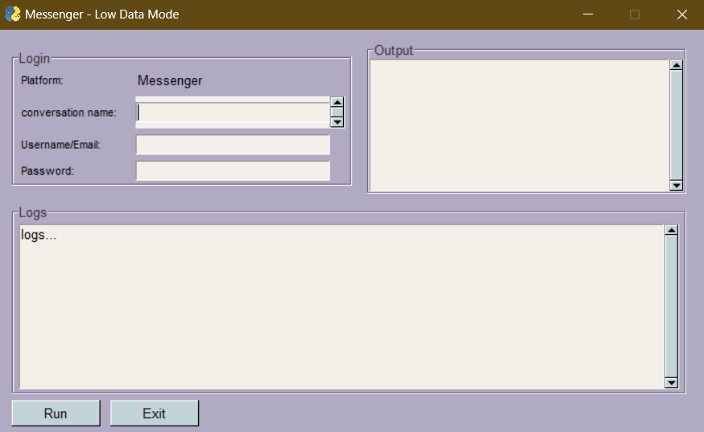

# MetaMessenger_LowDataMode
a python program intended to be hosted in the cloud 
that when needed it converts last picture of 
each contact on the list of friends on the 
platform to text with the help of a trained 
model "CLIP Interrogator" and OCR


## Requirements
web based stable diffusion with --api flag [GitHub](https://github.com/AUTOMATIC1111/stable-diffusion-webui)

clip-interrogator-ext [GitHub](https://github.com/pharmapsychotic/clip-interrogator-ext)

pytesseract [Website](https://pypi.org/project/pytesseract/)

## Usage

```commandline
python -m app.py
